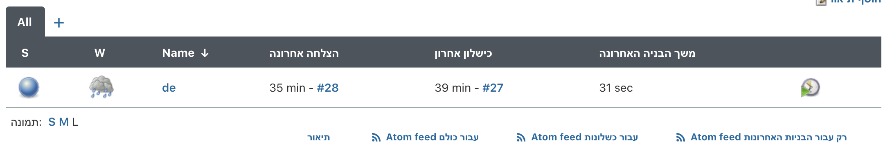

# HelloWorldMaven
## Task 1 - Running the jenkins container
```zhs
docker pull jenkins/jenkins
docker run -d -v jenkins_home:/var/jenkins_home -p 11000:8080 jenkins/jenkins
```
docker run:

-d - run in detached mode

All Jenkins data is stored in `/var/jenkins_home`, so i used -v flag to map a local docker volume, named `jenkins_home`, so we don't lose any data.

-p 11000:8080 - mapped 8080 port of the web UI to port 11000 in my laptop, so I can access Jenkins web UI through port 11000.

## Task 2 - Install Maven on the running container
Since container is run in detached mode, I ran the command docker exec in order to run bash while container is running:
```zhs
docker exec -u root -it d9f8 bash
```
`d9f8` - container ID

After a bash terminal of the container was opened, I ran the commands:
```bash
apt-get update
apt-get install maven
```
Then, I exited this bash termial of the container.

## Task 3 - Configure Maven in Jenkins settings
Entered the web UI using the addres: `0.0.0.0:11000`

Then, to get the required administrator password, I used the command:
```zhs
docker exec d9f8 cat /var/jenkins_home/secrets/initialAdminPassword
```

Afterwards, I chose to install Jenkins with suggested plugins.

Used [This Guide](https://www.tutorialspoint.com/jenkins/jenkins_maven_setup.htm) to configure Maven in Jenkins:


## Task 4 + 5 - Fork repo and Create a Pipeline job that will checkout from your own fork
Configured pipeline to my repository:


## Task 6 - Define job
See [JenkinsfileUnix](https://github.com/liroyc14/HelloWorldMaven/blob/master/JenkinsfileUnix)

Resources: 
https://www.jenkins.io/doc/book/pipeline/syntax/

## Task 7 - Run the job and make sure it finishes successfully


### Console Output:

```
Started by user admin
Obtained JenkinsfileUnix from git git@github.com:liroyc14/HelloWorldMaven.git
Running in Durability level: MAX_SURVIVABILITY
[Pipeline] Start of Pipeline
[Pipeline] stage
[Pipeline] { (Build)
[Pipeline] node
Running on Jenkins in /var/jenkins_home/workspace/de
[Pipeline] {
[Pipeline] ws
Running in /var/jenkins_home/main/java/com/test/HelloWorldMaven
[Pipeline] {
[Pipeline] checkout
using credential GitHub-SSH
Cloning the remote Git repository
Cloning repository git@github.com:liroyc14/HelloWorldMaven.git
 > git init /var/jenkins_home/main/java/com/test/HelloWorldMaven # timeout=10
Fetching upstream changes from git@github.com:liroyc14/HelloWorldMaven.git
 > git --version # timeout=10
 > git --version # 'git version 2.11.0'
using GIT_SSH to set credentials GitHub-SSH
 > git fetch --tags --progress -- git@github.com:liroyc14/HelloWorldMaven.git +refs/heads/*:refs/remotes/origin/* # timeout=10
 > git config remote.origin.url git@github.com:liroyc14/HelloWorldMaven.git # timeout=10
 > git config --add remote.origin.fetch +refs/heads/*:refs/remotes/origin/* # timeout=10
 > git config remote.origin.url git@github.com:liroyc14/HelloWorldMaven.git # timeout=10
Fetching upstream changes from git@github.com:liroyc14/HelloWorldMaven.git
using GIT_SSH to set credentials GitHub-SSH
 > git fetch --tags --progress -- git@github.com:liroyc14/HelloWorldMaven.git +refs/heads/*:refs/remotes/origin/* # timeout=10
 > git rev-parse refs/remotes/origin/master^{commit} # timeout=10
 > git rev-parse refs/remotes/origin/origin/master^{commit} # timeout=10
Checking out Revision 5863ac65c0848fc16721a6b132c28c3067ecd245 (refs/remotes/origin/master)
 > git config core.sparsecheckout # timeout=10
 > git checkout -f 5863ac65c0848fc16721a6b132c28c3067ecd245 # timeout=10
Commit message: "add label to node"
 > git rev-list --no-walk fe591d7fed780ac7e97905e586a32751aabd5325 # timeout=10
[Pipeline] withEnv
[Pipeline] {
[Pipeline] tool
[Pipeline] envVarsForTool
[Pipeline] withEnv
[Pipeline] {
[Pipeline] sh
+ mvn clean compile
[INFO] Scanning for projects...
[INFO]                                                                         
[INFO] ------------------------------------------------------------------------
[INFO] Building HelloWorldMaven 1.0.4-SNAPSHOT
[INFO] ------------------------------------------------------------------------
[INFO] 
[INFO] --- maven-clean-plugin:2.5:clean (default-clean) @ HelloWorldMaven ---
[INFO] 
[INFO] --- maven-resources-plugin:2.6:resources (default-resources) @ HelloWorldMaven ---
[INFO] Using 'UTF-8' encoding to copy filtered resources.
[INFO] skip non existing resourceDirectory /var/jenkins_home/main/java/com/test/HelloWorldMaven/src/main/resources
[INFO] 
[INFO] --- maven-compiler-plugin:3.2:compile (default-compile) @ HelloWorldMaven ---
[INFO] Changes detected - recompiling the module!
[INFO] Compiling 1 source file to /var/jenkins_home/main/java/com/test/HelloWorldMaven/target/classes
[INFO] ------------------------------------------------------------------------
[INFO] BUILD SUCCESS
[INFO] ------------------------------------------------------------------------
[INFO] Total time: 3.647 s
[INFO] Finished at: 2020-08-26T21:21:52+00:00
[INFO] Final Memory: 12M/122M
[INFO] ------------------------------------------------------------------------
[Pipeline] }
[Pipeline] // withEnv
[Pipeline] }
[Pipeline] // withEnv
[Pipeline] }
[Pipeline] // ws
[Pipeline] }
[Pipeline] // node
[Pipeline] }
[Pipeline] // stage
[Pipeline] stage
[Pipeline] { (Test)
[Pipeline] node
Running on Jenkins in /var/jenkins_home/workspace/de
[Pipeline] {
[Pipeline] ws
Running in /var/jenkins_home/test/java/com/test/HelloWorldMaven
[Pipeline] {
[Pipeline] checkout
using credential GitHub-SSH
Cloning the remote Git repository
Cloning repository git@github.com:liroyc14/HelloWorldMaven.git
 > git init /var/jenkins_home/test/java/com/test/HelloWorldMaven # timeout=10
Fetching upstream changes from git@github.com:liroyc14/HelloWorldMaven.git
 > git --version # timeout=10
 > git --version # 'git version 2.11.0'
using GIT_SSH to set credentials GitHub-SSH
 > git fetch --tags --progress -- git@github.com:liroyc14/HelloWorldMaven.git +refs/heads/*:refs/remotes/origin/* # timeout=10
 > git config remote.origin.url git@github.com:liroyc14/HelloWorldMaven.git # timeout=10
 > git config --add remote.origin.fetch +refs/heads/*:refs/remotes/origin/* # timeout=10
 > git config remote.origin.url git@github.com:liroyc14/HelloWorldMaven.git # timeout=10
Fetching upstream changes from git@github.com:liroyc14/HelloWorldMaven.git
using GIT_SSH to set credentials GitHub-SSH
 > git fetch --tags --progress -- git@github.com:liroyc14/HelloWorldMaven.git +refs/heads/*:refs/remotes/origin/* # timeout=10
 > git rev-parse refs/remotes/origin/master^{commit} # timeout=10
 > git rev-parse refs/remotes/origin/origin/master^{commit} # timeout=10
Checking out Revision 5863ac65c0848fc16721a6b132c28c3067ecd245 (refs/remotes/origin/master)
 > git config core.sparsecheckout # timeout=10
 > git checkout -f 5863ac65c0848fc16721a6b132c28c3067ecd245 # timeout=10
Commit message: "add label to node"
[Pipeline] withEnv
[Pipeline] {
[Pipeline] tool
[Pipeline] envVarsForTool
[Pipeline] withEnv
[Pipeline] {
[Pipeline] sh
+ mvn test
[INFO] Scanning for projects...
[INFO]                                                                         
[INFO] ------------------------------------------------------------------------
[INFO] Building HelloWorldMaven 1.0.4-SNAPSHOT
[INFO] ------------------------------------------------------------------------
[INFO] 
[INFO] --- maven-resources-plugin:2.6:resources (default-resources) @ HelloWorldMaven ---
[INFO] Using 'UTF-8' encoding to copy filtered resources.
[INFO] skip non existing resourceDirectory /var/jenkins_home/test/java/com/test/HelloWorldMaven/src/main/resources
[INFO] 
[INFO] --- maven-compiler-plugin:3.2:compile (default-compile) @ HelloWorldMaven ---
[INFO] Changes detected - recompiling the module!
[INFO] Compiling 1 source file to /var/jenkins_home/test/java/com/test/HelloWorldMaven/target/classes
[INFO] 
[INFO] --- maven-resources-plugin:2.6:testResources (default-testResources) @ HelloWorldMaven ---
[INFO] Using 'UTF-8' encoding to copy filtered resources.
[INFO] skip non existing resourceDirectory /var/jenkins_home/test/java/com/test/HelloWorldMaven/src/test/resources
[INFO] 
[INFO] --- maven-compiler-plugin:3.2:testCompile (default-testCompile) @ HelloWorldMaven ---
[INFO] Changes detected - recompiling the module!
[INFO] Compiling 1 source file to /var/jenkins_home/test/java/com/test/HelloWorldMaven/target/test-classes
[INFO] 
[INFO] --- maven-surefire-plugin:2.17:test (default-test) @ HelloWorldMaven ---
[INFO] Surefire report directory: /var/jenkins_home/test/java/com/test/HelloWorldMaven/target/surefire-reports

-------------------------------------------------------
 T E S T S
-------------------------------------------------------
Running com.test.HelloWorldMaven.AppTest
Tests run: 1, Failures: 0, Errors: 0, Skipped: 0, Time elapsed: 0.032 sec - in com.test.HelloWorldMaven.AppTest

Results :

Tests run: 1, Failures: 0, Errors: 0, Skipped: 0

[INFO] ------------------------------------------------------------------------
[INFO] BUILD SUCCESS
[INFO] ------------------------------------------------------------------------
[INFO] Total time: 4.991 s
[INFO] Finished at: 2020-08-26T21:22:07+00:00
[INFO] Final Memory: 14M/124M
[INFO] ------------------------------------------------------------------------
[Pipeline] }
[Pipeline] // withEnv
[Pipeline] }
[Pipeline] // withEnv
[Pipeline] }
[Pipeline] // ws
[Pipeline] }
[Pipeline] // node
[Pipeline] }
[Pipeline] // stage
[Pipeline] End of Pipeline
Finished: SUCCESS
```