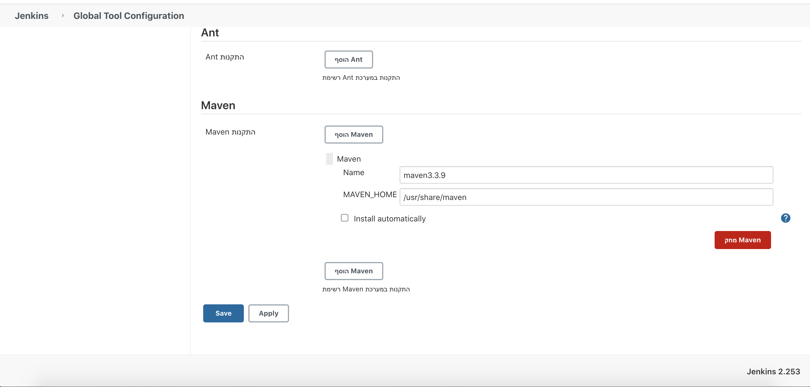
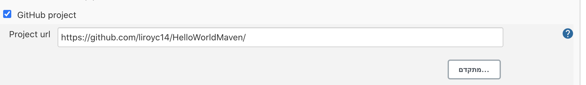
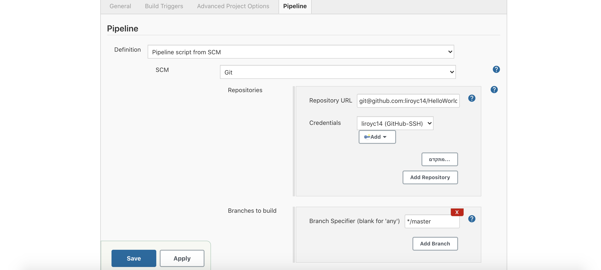

# HelloWorldMaven
## Task 1 - Running the jenkins container
```zhs
docker pull jenkins/jenkins
docker run -d -v jenkins_home:/var/jenkins_home -p 11000:8080 jenkins/jenkins
```
docker run:

-d - run in detached mode

All Jenkins data is stored in `/var/jenkins_home`, so i used -v flag to map a local docker volume, named `jenkins_home`, so we don't lose any data.

-p 11000:8080 - mapped 8080 port of the web UI to port 11000 in my laptop, so I can access Jenkins web UI through port 11000.

## Task 2 - Install Maven on the running container
Since container is run in detached mode, I ran the command docker exec in order to run bash while container is running:
```zhs
docker exec -u root -it d9f8 bash
```
`d9f8` - container ID

After a bash terminal of the container was opened, I ran the commands:
```bash
apt-get update
apt-get install maven
```
Then, I exited this bash termial of the container.

## Task 3 - Configure Maven in Jenkins settings
Entered the web UI using the addres: `0.0.0.0:11000`

Then, to get the required administrator password, I used the command:
```zhs
docker exec d9f8 cat /var/jenkins_home/secrets/initialAdminPassword
```

Afterwards, I chose to install Jenkins with suggested plugins.

Used [This Guide](https://www.tutorialspoint.com/jenkins/jenkins_maven_setup.htm) to configure Maven in Jenkins:



## Task 4 + 5 - Fork repo and Create a Pipeline job that will checkout from your own fork
Configured pipeline to my repository:



## Task 6 - Define job
Defined job to checkout code from my repository in the previous step.

Use Maven to compile the project: